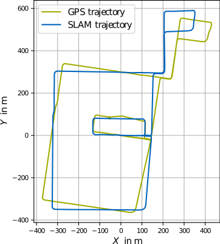
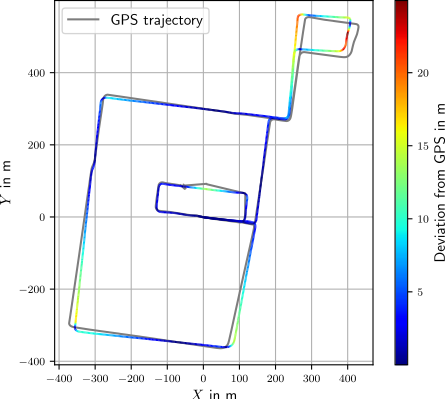
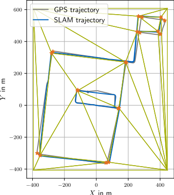
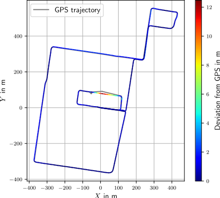

# Geometric Alignment

- calculation of transformation based on GNSS and SLAM trajectories
- trajectories do not have to be time-synchronized
- either GNSS OR SLAM trajectory chosen as master => other trajectory matched to it (georeferencing only possible if GNSS as master)
- application of calculated transformation on lanelet map/[OpenStreetMap](openstreetmap.org/) excerpt

## 1. Projection of GPS coordinates

- GNSS trajectory projected into local coordinate system using [UTM-projection](https://apps.dtic.mil/sti/pdfs/ADA266497.pdf) from the [lanelet2 library](https://github.com/fzi-forschungszentrum-informatik/Lanelet2/tree/master/lanelet2_projection)
- origin of grid for projection set to first GNSSS point
- Coordinates from [OpenStreetMap](openstreetmap.org/) projected the same way
- screenshot below shows results of projection of GPS trajectory for test data\
  

## 2. Alignment of trajectories by rigid transformation

- target trajectory aligned to master using [Umeyama algorithm](https://web.stanford.edu/class/cs273/refs/umeyama.pdf) transformation (default, to be preferred) or [PCL ICP](https://pointclouds.org/documentation/classpcl_1_1_iterative_closest_point.html) in 2D
- Umeyama algorithm requires equivalent amount of points between trajectories => a predefined amount of points (=> config file) is interpolated over the length of the trajectory
- application of calculated transformation on target trajectory, lanelet map/[OpenStreetMap](openstreetmap.org/) excerpt (depending on master)
- screenshot below shows results of alignment of SLAM trajectory to projected GPS trajectory (=> master = osm) with [Umeyama algorithm](https://web.stanford.edu/class/cs273/refs/umeyama.pdf)\
  

## 3. Rubber-Sheet transformation

- piecewise linear rubber-sheet transformation in 2D based [Griffin & White](https://www.tandfonline.com/doi/abs/10.1559/152304085783915135)
- manual selection of control points in RVIZ (see main documentation)
- application of calculated transformation on target trajectory, lanelet map/[OpenStreetMap](openstreetmap.org/) excerpt (depending on master)
- the two screenshots below show selected control points on the aligned trajectories from step 2 and the results of the rubber-sheet transformation\
   

## Transformation of point cloud map

- if GNSS is chosen as master (=> GNSS trajectory is master trajectory), the point cloud map corresponding to the lanelet map and the SLAM trajectory can also be transformed (adjust the corresponding parameters in the config file)
