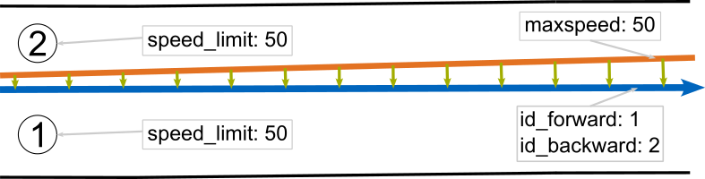
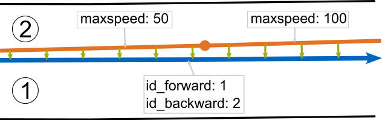
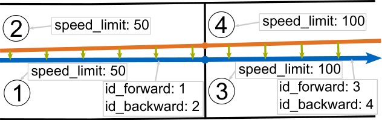
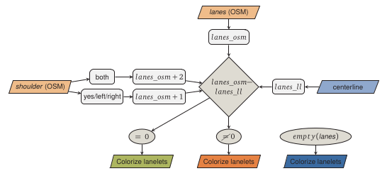
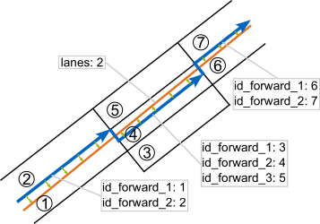

# Conflation

## Overview

- conflation of semantic attributes from [OpenStreetMap](openstreetmap.org/) to lanelet map based on results of [matching](matching.md)
- visualization of agreement between amount of lanes in [OpenStreetMap](openstreetmap.org/) and adjacent lanes in lanelet map
- removal of lanelet fragments if they are likely to be mapped wrongly

### 1. Attribute transfer

- allowed participant and speed limit in lanelet2 inferred from lanelet attributes `subtype` and `location`
- relevant combinations shown in table below (taken from [lanelet2](https://github.com/fzi-forschungszentrum-informatik/Lanelet2/blob/master/lanelet2_core/doc/LaneletAndAreaTagging.md))

|   `subtype`    | `location` |              Description               |    Inferred participants     |       Speed limit       |
| :------------: | :--------: | :------------------------------------: | :--------------------------: | :---------------------: |
|     `road`     |  `urban`   |    A part of a road in urban region    |    All vehicles and bikes    |    City speed limit     |
|     `road`     | `nonurban` |  A part of a road in nonurban region   |    All vehicles and bikes    |  Nonurban speed limit   |
|   `highway`    |  `urban`   |  A part of a highway in urban region   |         All vehicles         |   Urban highway limit   |
|   `highway`    | `nonurban` | A part of a highway in nonurban region |         All vehicles         | Nonurban highway limit  |
| `play_street`  |            |        A part of a play street         | Vehicles, bikes, pedestrians | play street speed limit |
|   `bus_lane`   |  `urban`   |            Lane for busses             |     Bus, Emergency, Taxi     |    City speed limit     |
|   `bus_lane`   | `nonurban` |            Lane for busses             |     Bus, Emergency, Taxi     |  Nonurban speed limit   |
| `bicycle_lane` |            |  A lane that is usable only for bikes  |            Bikes             |   Average bike speed    |

- highway tag from [OpenStreetMap Wiki](https://wiki.openstreetmap.org/wiki/Key:highway) used to infer attributes `subtype` and `location` according to following custom mapping:

|       `highway`       | Description OSM Wiki                                                                                                                                                                                                                                                                                                         |   `subtype`    | `location` |
| :-------------------: | :--------------------------------------------------------------------------------------------------------------------------------------------------------------------------------------------------------------------------------------------------------------------------------------------------------------------------- | :------------: | :--------: |
|      `motorway`       | A restricted access major divided highway, normally with 2 or more running lanes plus emergency hard shoulder. Equivalent to the Freeway, Autobahn, etc..                                                                                                                                                                    |   `highway`    | `nonurban` |
|        `trunk`        | The most important roads in a country's system that aren't motorways. (Need not necessarily be a divided highway.)                                                                                                                                                                                                           |   `highway`    | `nonurban` |
|       `primary`       | The next most important roads in a country's system. (Often link larger towns.)                                                                                                                                                                                                                                              |     `road`     |  `urban`   |
|      `secondary`      | The next most important roads in a country's system. (Often link towns.)                                                                                                                                                                                                                                                     |     `road`     |  `urban`   |
|      `tertiary`       | The next most important roads in a country's system. (Often link smaller towns and villages)                                                                                                                                                                                                                                 |     `road`     |  `urban`   |
|    `unclassified`     | The least important through roads in a country's system – i.e. minor roads of a lower classification than tertiary, but which serve a purpose other than access to properties. (Often link villages and hamlets.)                                                                                                            |     `road`     |  `urban`   |
|     `residential`     | Roads which serve as an access to housing, without function of connecting settlements. Often lined with housing.                                                                                                                                                                                                             |     `road`     |  `urban`   |
|    `motorway_link`    | The link roads (sliproads/ramps) leading to/from a motorway from/to a motorway or lower class highway. Normally with the same motorway restrictions.                                                                                                                                                                         |   `highway`    | `nonurban` |
|     `trunk_link`      | The link roads (sliproads/ramps) leading to/from a trunk road from/to a trunk road or lower class highway.                                                                                                                                                                                                                   |   `highway`    | `nonurban` |
|    `primary_link`     | The link roads (sliproads/ramps) leading to/from a primary road from/to a primary road or lower class highway.                                                                                                                                                                                                               |     `road`     |  `urban`   |
|   `secondary_link`    | The link roads (sliproads/ramps) leading to/from a secondary road from/to a secondary road or lower class highway.                                                                                                                                                                                                           |     `road`     |  `urban`   |
|    `tertiary_link`    | The link roads (sliproads/ramps) leading to/from a tertiary road from/to a tertiary road or lower class highway.                                                                                                                                                                                                             |     `road`     |  `urban`   |
|    `living_street`    | For living streets, which are residential streets where pedestrians have legal priority over cars, speeds are kept very low and where children are allowed to play on the street.                                                                                                                                            | `play_street`  |            |
|       `service`       | For access roads to, or within an industrial estate, camp site, business park, car park, alleys, etc. Can be used in conjunction with `service=*` to indicate the type of usage and with `access=*` to indicate who can use it and in what circumstances.                                                                    |     `road`     |  `urban`   |
| `road` (unknown type) | A road/way/street/motorway/etc. of unknown type. It can stand for anything ranging from a footpath to a motorway. This tag should only be used temporarily until the road/way/etc. has been properly surveyed. If you do know the road type, do not use this value, instead use one of the more specific `highway=*` values. |                |            |
|       `busway`        | A dedicated roadway for bus rapid transit systems                                                                                                                                                                                                                                                                            |   `bus_lane`   |  `urban`   |
|      `cycleway`       | For designated cycleways. Add `foot=*`, though it may be avoided if default-access-restrictions do apply.                                                                                                                                                                                                                    | `bicycle_lane` |            |

- additionally, the following attributes are transferred to their counterparts:
  - transfer of `maxspeed` tag to lanelet2 `speed_limit` tag
  - transfer of `name` tag to lanelet2 `road_name` tag
  - transfer of `surface` tag to lanelet2 `road_surface` tag
  - transfer of `oneway` tag to lanelet2 `one_way` tag
  - transfer of `lane_markings` tag to lanelet2 `lane_markings` tag
- attribute transfer realized based on stored lanelets in the collapsed centerlines from the preprocessing step
- if the value of an attribute in [OpenStreetMap](openstreetmap.org/) changes over a match, the corresponding lanelets are splitted
- images below show principle of simple attribute transfer and the special case of an attribute change during a match
  {height=150px}\
  {height=150px} {height=150px}

### 2. Evaluation of Adjacent Lanes

- sum up the amount of adjacent lanelets in the lanelet map
- compare to `lanes` attribute from [OpenStreetMap](openstreetmap.org/) (also considering the attribute `shoulder` and incrementing the amount of lanes, if necessary) and colorize lanelets correspondingly
- image below shows the process for the evaluation\
  

  - `lanes` tag = amount of adjacent lanelets => green
  - `lanes` tag != amount of adjacent lanelets => red
  - no `lanes` tag => blue
  - no match for polyline => white

- if `lanes` or `shoulder` change over a match, the process is analogous to the attribute transfer (splitting of lanelets)

### 3. Deletion of Lanelet Fragments

- if for an identified match the lanelet map contains more adjacent lanelets than [OpenStreetMap](openstreetmap.org/) indicates, the package tries to remove wrongly mapped lanelets:
  - as long as there are more adjacent lanelets in the lanelet map than [OpenStreetMap](openstreetmap.org/) indicates, lanelets are removed if they neither have a predecessor nor a successor
  - more steps can be implemented, however, keep in mind that you are absolutely sure if you want to delete something as the information from [OpenStreetMap](openstreetmap.org/) might be wrong as well
- image below exemplarily shows the deletion of an existing lanelet fragment\
  {height=300px}
