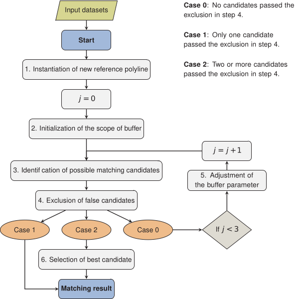
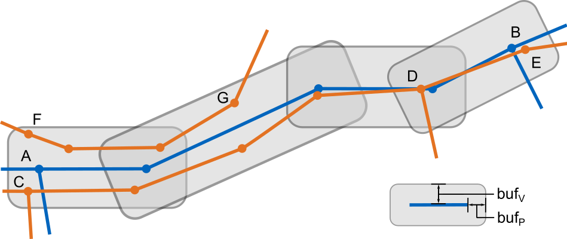

# Matching

## Overview

- Buffer-Growing algorithm modified from [Zhang and Meng](https://www.semanticscholar.org/paper/A-generic-matching-algorithm-for-line-networks-of-Zhang-Shi/3e055f09341508dc0608e60a2f419df69968def6)
- input:
  - collapsed lanelet2 map after [preprocessing](preprocessing.md) step
  - road network (linestrings) from [OpenStreetMap](openstreetmap.org/)
- image below shows the process of the matching algorithm\
  

## Algorithm

### 1. Instantiation of new reference polyline

- concatenation of single segments of collapsed centerlines from [preprocessing](preprocessing.md) step
- polyline extended as long as:
  - angle between current and potential new segment < pline_angle
  - degree of node < 3 (no intersection)
- e.g. in image below, the polyline A-B is created

### 2. Initialization of the scope of buffer

{height=250px}

- creation of buffers around segments of reference polyline
- buffer size determined by vertical and longitudinal size ($buf_v$ and $buf_p$)

### 3. Identification of possible matching candidates

- find match candidates out of [OpenStreetMap](openstreetmap.org/) road network that entirely fall inside buffers in image above
- concatenate single segments of [OpenStreetMap](openstreetmap.org/) based on topological properties
  e.g. in image above: F-G, C-D, C-E, D-E are candidates

### 4. Exclusion of false candidates

- set of candidates contains wrong suggestions
- remove wrong candidates based on geometric similarity to reference polyline
- implemented thresholds:

```math
\Delta \beta = |\beta_{reference} - \beta_{candidate}| < lim_{\beta} \\[5pt]
\Delta l = |l_{reference} - l_{candidate}| < lim_{l} \\[5pt]
\Delta d = |d_{reference} - d_{candidate}| < lim_{d} \\[5pt]
\bar{S} = \left| \frac{S_{reference, candidate}}{l_{reference} + l_{candidate}} \right| < lim_{\bar{S}} \\
```

- $\beta$: angle between a line connecting end points of polyline and x-axis
- $l$: length of polyline
- $d$: chord of polyline defined as the distance between its end points
- $S$: area polygon enclosed by two polygons
- thresholds $lim_{\beta}$, $lim_{l}$, $lim_{d}$, and $lim_{\bar{S}}$ to be set in config file

### 5. Adjustment of buffer parameters

- case: no candidate passed exclusion step 4 due to too small buffers in step 2
- enlargement of buffer parameters to find additional candidates and jump to step 2 again
- process may be repeated 3 times

### 6. Selection of best candidate

- case: multiple candidates passed exclusion step 4
- selection of best candidate based on weighted sum of geometric similarity properties:

```math
score = w_{\beta} \left(1 - \frac{\Delta \beta}{lim_{\beta}} \right) + w_{l} \left(1 - \frac{\Delta l}{lim_{l}} \right) + w_{d} \left(1 - \frac{\Delta d}{lim_{d}} \right) + w_{\bar{S}} \left(1 - \frac{\bar{S}}{lim_{\bar{S}}} \right)
```

- parameters $w_{\beta}$, $w_{l}$, $w_{d}$, and $w_{\bar{S}}$ to be set in config file
