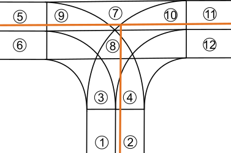
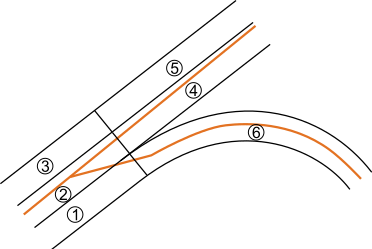
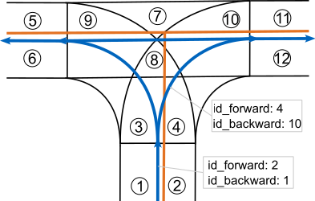
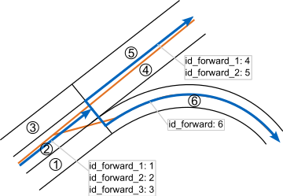

# Preprocessing

## Overview

- different levels of detail (LOD) between lanelet2 and [OpenStreetMap](openstreetmap.org/)
- lanelet2 map shows road network with lane-level accuracy (lanelets wit boundaries, turning lanes etc.)
- [OpenStreetMap](openstreetmap.org/) summarizes all lanes on a single road to one linestring
- images below show road representation of lanelet2 (black) and [OpenStreetMap](openstreetmap.org/) (orange) exemplary for an intersection and a highway exit
   

- preprocessing step of algorithm collapses adjacent lanelets of lanelet map to centerlines
- centerlines are topologically connected based on the followers/predeccessors of the lanelets they represent
- the lanelets a centerline represents are stored in the centerline by their ids
- images below show the results of the preprocessing step; blue lines indicate new centerlines (text boxes represent their attributes)
   
